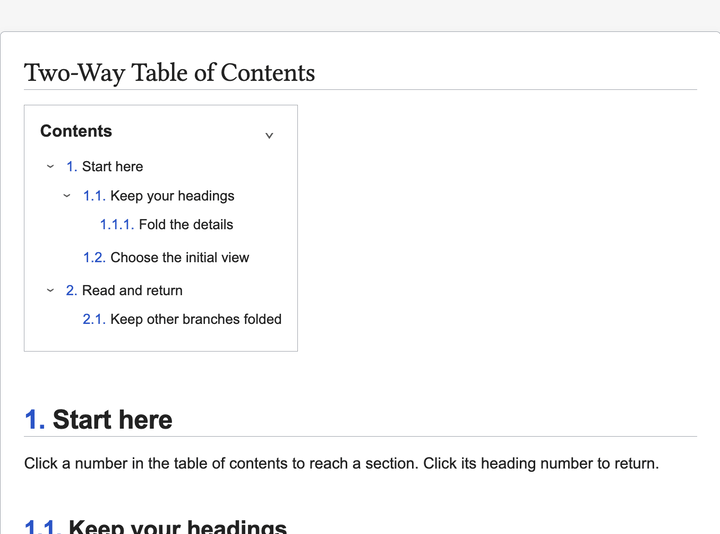

# Two-Way Table of Contents

Navigate from a table of contents to headings and back, without changing your Markdown headings or existing links.

[한국어 사용법](README.ko.md)



Four steps captured in Obsidian: expanded outline → folded branches → body heading → return with the matching entry highlighted. [Video](docs/demo.mp4) · [Example note](docs/demo.md)

## Use

Run **Insert table of contents** from the command palette while editing a note, or insert:

````markdown
```tw-toc
```
````

Switch to **Reading view**. The table of contents updates when headings change.

- Click a **number** to jump to its heading.
- Enable **Number headings** in settings to add display-only numbers to the body. Click those numbers to return to the first table of contents.
- Click an **arrow** to collapse or expand descendants. All headings are expanded by default.
- Returning from the body opens the first table of contents and only the ancestors of the target item, then highlights that row.

## Heading range and folding

The heading range controls which headings are included. **Initially expanded heading level** is a numeric setting from 0 to 6: 0 (default) expands all; 3 expands through H3 and folds H4 onward; 1 folds descendants beneath H1. This uses the actual Markdown heading level, regardless of font size or the included heading range.

Top-level entries always remain visible so they can be expanded, including when H1 is absent. Skipped levels do not hide included siblings: with H2 → H4 → H3 and a limit of 3, H4 is hidden while H3 stays visible. A partially expanded branch opens its remaining children on the next arrow click; the following click folds all children. Numbering is unchanged. Quotes, callouts, code examples, and embedded headings are excluded.

Defaults: H1–H6, body numbering off, manual-number replacement off, body auto-expansion off, collapsible branches on, and all levels expanded. No expansion selector appears inside the table of contents. Turning off collapsible branches disables the initial-level input while preserving its value.

Each table of contents has independent fold state in its open view. Heading updates preserve matching items; ambiguous edits to duplicate headings may reset or reassign their state. TOC block edits with uncertain identity reset that block rather than borrowing another block’s state. Switching files or restarting the app restores the initial heading level setting. Fold state is not written to your note or properties.

## Customize a block

Omitted options keep following global settings. In the insertion dialog, enable only the overrides you want; **Reset overrides** returns to inheritance.

````markdown
```tw-toc
title: Contents
position: 0
scale: 90
branches: true
depth: 3
```
````

| Option | Accepted values |
|---|---|
| `title` | Up to 200 characters; empty allowed |
| `position` | 0–100; 0 left, 50 center, 100 right |
| `scale` | 25–200; scales text and box spacing |
| `border` | `true` or `false` |
| `background` | `transparent`, `#RRGGBB`, or `#RRGGBBAA` |
| `collapsible` | Show the whole-table collapse button |
| `branches` | Show branch buttons; false displays all descendants |
| `guides` | `true` or `false`; show subtle hierarchy guides |
| `depth` | Integer 0–6; 0 expands all, 3 folds H4 onward (top-level entries stay visible) |

The `depth` option uses an absolute H1–H6 cutoff, not relative nesting depth.

Options use one `key: value` per line, not full YAML. Invalid values show a message and fall back to global settings. Heading range, body numbering, number replacement, and body auto-expansion are global only.

Heading labels support bold, italics, strikethrough, inline code, and `==highlight==`. Links and images contribute display text only. Only numbers navigate; title text does not.

## Editing, finding, and copying

Right-click a table of contents to **Edit this table of contents**, copy Markdown/text, inspect settings, or expand/collapse/reset its branches. Right-click an entry to copy its link or section content, copy its descendants as an outline, or fold that branch. The command palette provides the same actions plus **Find a heading**, **Previous heading**, **Next heading**, and **Return to first table of contents**. No default hotkeys are added.

Editing preserves comments, unknown options, and unchanged values. A source change while the dialog is open prevents an outdated save. Omitted options continue following global settings. The palette asks you to choose when multiple tables are ambiguous.

Copies include folded entries and preserve the document's calculated numbers. Section content includes its heading and descendants; section outlines include descendants only. External links to duplicate heading names may not distinguish their destinations. Search and copying also work in the editor; folding and returning to the table require Reading view.

Hierarchy guides and modifier-hover heading previews are opt-in settings, both off by default. Preview uses Obsidian's Page preview capability and its source/modifier preferences.

## Automation

Official Obsidian CLI commands provide JSON without a separate server: `two-way-table-of-contents:inspect`, `:validate`, `:section`, `:block`, and `:export` (use the full plugin prefix for each). See [command reference](docs/COMMANDS.md) for arguments, source hashes, error codes, and examples. Obsidian, the plugin, and CLI must be enabled. Reads use the saved file, not unsaved editor contents.

## Existing numbers and older settings

**Replace existing section numbers** recognizes a leading dotted number followed by whitespace, such as `2. ` or `2.1. `. It changes display only. A title like `1984. A novel` has the same shape and will also match. Turn replacement off to keep it. Existing heading links remain unchanged.

Older development builds used style, click-target, and `tw-toc-*` note-property options. This release ignores those legacy values. Source notes are never automatically migrated or cleaned up.

## Compatibility

Desktop Obsidian **1.13.7 or newer**, Reading view. Live Preview and mobile are outside the supported scope. Static Markdown/text export is available; exported files do not retain live folding or body numbering. Navigation uses version-sensitive renderer internals in `src/preview.ts`; app updates require navigation and folding checks.

Global settings can be found by name in Obsidian's settings search. Navigation cancels if its window becomes hidden; click again after returning to the window.

The interface follows Obsidian's language: Korean for Korean, English otherwise. Saved titles are preserved.

## Manual installation

Build locally, or use a release's `main.js`, `manifest.json`, and `styles.css`. Copy those three files to `<vault>/<config-folder>/plugins/two-way-table-of-contents/` (`.obsidian` is the default config folder), then enable the plugin in Community plugins. Do not copy `node_modules` or development sources.

## Development

```sh
npm ci --ignore-scripts
npm run lint
npm run check
npm test
npm run build
```

`src/model.ts` validates options and calculates numbers. `src/folding.ts` manages the visible hierarchy; `src/main.ts` integrates rendering and navigation; `src/settings.ts` and `src/insert-modal.ts` provide UI. `src/preview.ts` isolates renderer internals. Tests exercise production methods with isolated app adapters; actual app checks remain necessary for layout, keyboard access, and scrolling.

See [release preparation](RELEASING.md) for packaging and manual checks.

## Privacy and license

No network requests or telemetry. File writes are limited to confirmed table-of-contents insertion/editing and plugin settings. CLI commands only read notes or return generated text. Arbitrary HTML, scripts, and embedded content in heading labels are not executed.

[MIT](LICENSE). Bundled library licenses are included in [THIRD_PARTY_NOTICES.md](THIRD_PARTY_NOTICES.md) and in the JavaScript bundle.
